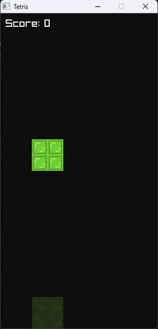

# Tetris Clone

This is a very simple tetris clone written in C (mostly to practice my C skills). It uses [raylib](https://www.raylib.com/) to render graphics.



## Building the source code

This project uses GCC to compile the source code. To build the project, you need to have GCC installed on your system. On Windows you can use [MinGW](https://www.mingw-w64.org/) to get GCC.

```bash
# Clone the repository
git clone https://github.com/KineticTactic/Tetris-C.git
cd Tetris-C

# Compile the source code
make

```

The executable will be created in the `bin` directory.
